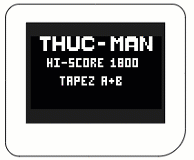
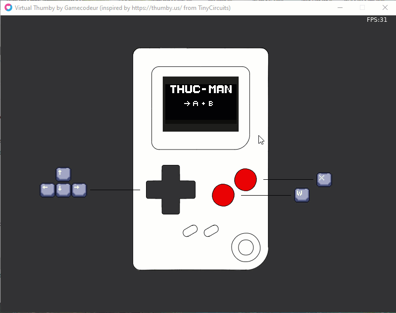
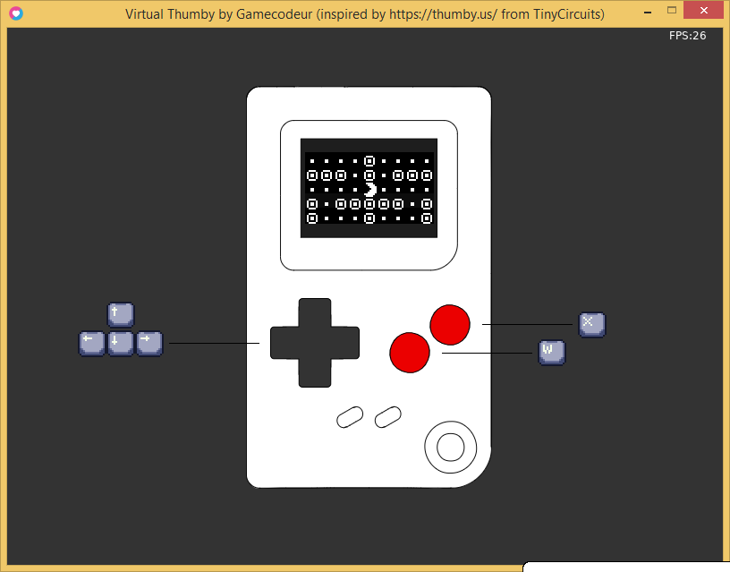
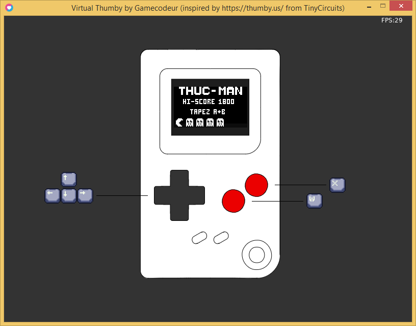

# Thuc-Man

Un clone de Pacman.  
Réalisé pour la [Gamecodeur Game Jam #36](https://itch.io/jam/gamecodeur-gamejam-36)

## Theme : Virtual Thumby

Coder un jeu pour la console virtuelle Virtual Thumby

## Genèse du jeu:

Je potasse ce projet depuis plusieurs années maintenant. Cela remonte à avant mon adhésion à Gamecodeur
(essai gratuit en 2019). J'ai commencé par faire un casse brique, puis un tétris, mais je savais que je n'avais
pas encore le niveau pour faire un clone de Pacman. Je me gardais donc ceprojet de côté le temps que j'acquiert un niveau suffisant. En juin 2021, j'ai pu, grâce à une réduction, prendre une adhésion à vie à Gamecodeur et m'amélioer consodérablement.  
Le déclic s'est produit quand David a annoncé que que dans le cadre de cette jam, on vacoder un jeu pour
la Virtual Thumby. Je me suis dit que c'estl'ocasion idéale. Coder un classique en ayant des contraintes
proches de ceux d'antan, ce sera à la fois fun et formteur. Ayant fait un Lode Runner et un jeu de Zombies
(avec IA des ennemies), je crois avoir le niveau pour rélever ce challenge.

### Langue : Lua

### Framework : Virtual Thumby

### [Y accéder sur itch.io](https://senor16.itch.io/thuc-man)

### Controles :

Flèches du clavier  
W -> A  
X -> B  
Tapez les touches `W`+`A` pour commencer le jeu et dirrigez pacman avec les flèches.

### Code : par moi

### Sfx :

Récupéré sur un pacman de la pico 8 fait par [buck](https://www.lexaloffle.com/bbs/?pid=113097)

### Temps passé : 26h 40mins

### Screenshots:

by Sesso Kosga kosgasesso@gmail.com
